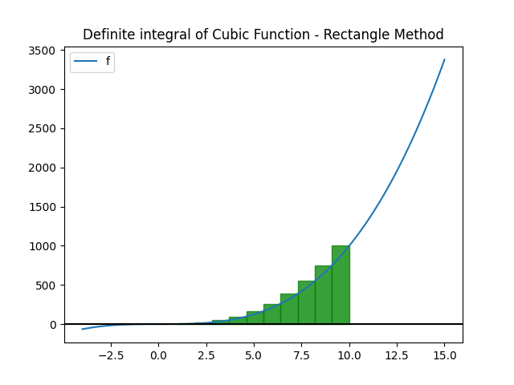

# IntegrationMethods
### From calculus to algorithm: discrete integration methods implemented in Python for the resolution of definite integrals


## Introduction

IntegrationMethods is a simple open source project, written in Python, aimed to provide useful modules for calculating definite integrals of any function using known numerical integration methods, mostly appreciated for their implementations rather than their actual results.


## Installation

The software needs the following dependencies to be installed in order to work correctly:

- python3, matplotlib, numpy

It is possible to install them globally or inside a virtual environment (preferred option). If you have never used a venv, follow these few steps:

```bash
pip install virtualenv
```

then, proceed setting your venv inside the project folder:

```bash
 python3 -m venv env
```

Activate it

```bash
source env/bin/activate
```

and eventually, install the dependencies through the requirements.txt file

```bash
pip install -r requirements.txt
```

If you want to check whether the installation have been successfully completed, run 

```bash
pip list
```

it should show something like this:

```bash
Package         Version
--------------- -----------
contourpy       1.2.1
cycler          0.12.1
fonttools       4.53.0
kiwisolver      1.4.5
matplotlib      3.9.0
numpy           2.0.0
packaging       24.1
pillow          10.3.0
pip             22.0.2
pyparsing       3.1.2
python-dateutil 2.9.0.post0
setuptools      59.6.0
six             1.16.0
```


## Usage

Methods can be used as independent modules and thereby exported or can be tested through main.py or benchmark.py.


### Main.py

In main.py, there's a simulation showing the three methods used on different functions.

> Note that each method behaves distinctly when used from a function to another one; so its curious how, depending on how it internally works, each method could be more suitable for certain kinds of functions than others (see below for further details).

Here's an example from the simulation showing the three methods used to calculate the definite integral of a cubic function from 1 to 10:
$$
\int_{1}^{10} x^3 \,dx
$$

- using the rectangle method:

  ```tex
  [Rectangle Method] definite integral from 10.0 to 1.0 of Cubic Function
  results: 2969.3475, calculated by cycling 10 times
  while exact result is 2499.75
  ```



- using the trapezoid method:

  ```tex
  [Trapezoid Method] definite integral from 10.0 to 1.0 of Cubic Function
  results: 2519.7974999999997, calculated by cycling 10 times
  while exact result is 2499.75
  ```


- using the Simpson method:

  ```tex
  [Simpson Method] definite integral from 10.0 to 1.0 of Cubic Function
  results: 2499.75, calculated by cycling 10 times
  while exact result is 2499.75
  ```


It is highly evident how starting from the rectangle method towards the Simpson's one, the accuracy increasingly enhances, due to their different behaviours and the functions they are used for. Particularly, the cubic function is a case of function in which Simpson's works perfectly and returns the exact result with very few iterations.

We'll make a specific analysis on accuracy and complexity in benchmark.py.

### Benchmark.py

benchmark.py has not been implemented yet...


## Software design and usability

The software has been designed in order to be maintainable and keep each module independent from the others. I opted to use an object oriented paradigm in order to manage the several components showing inside the software.


## Author

Giovanni Campo