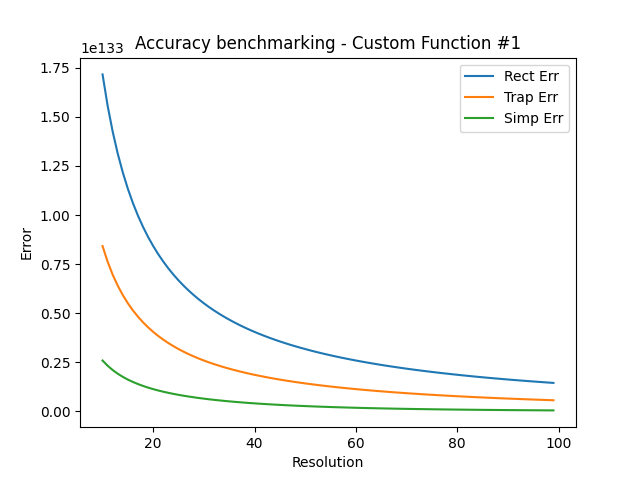

# IntegrationMethods
### From calculus to algorithm: discrete integration methods implemented in Python for the resolution of definite integrals


## Introduction

IntegrationMethods is a simple open source project, written in Python, aimed to provide useful modules for calculating definite integrals of any function using known numerical integration methods, mostly appreciated for their implementations rather than their actual results.

The idea to implement these methods in python was born some months ago while studying calculus; I was taking a deeper look at integrals online and suddenly came across a web site that introduced these methods and showed (in pseudo-code) how they could be implemented in the form of algorithm.

I strongly advice you to take a glance yourself and understand how these algorithms are derived and which mathematical steps conducted them into their final shape.

https://nsa.readthedocs.io/en/latest/03_integrali/docs/source/09_int_numerici.html


## Installation

The software needs the following dependencies to be installed in order to work correctly:

- python3, matplotlib, numpy

It is possible to install them globally or inside a virtual environment (preferred option). If you have never used a venv, follow these few steps:

```bash
pip install virtualenv
```

then, proceed setting your venv inside the project folder:

```bash
 python3 -m venv env
```

Activate it

```bash
source env/bin/activate
```

and eventually, install the dependencies through the requirements.txt file

```bash
pip install -r requirements.txt
```

If you want to check whether the installation have been successfully completed, run 

```bash
pip list
```

it should show something like this:

```bash
Package         Version
--------------- -----------
contourpy       1.2.1
cycler          0.12.1
fonttools       4.53.0
kiwisolver      1.4.5
matplotlib      3.9.0
numpy           2.0.0
packaging       24.1
pillow          10.3.0
pip             22.0.2
pyparsing       3.1.2
python-dateutil 2.9.0.post0
setuptools      59.6.0
six             1.16.0
```


## Usage

Methods can be used as independent modules and thereby exported or can be tested through main.py or benchmark.py.


### Main.py

In main.py, there's a simulation showing the three methods used on different functions.

> Note that each method behaves distinctly when used from a function to another one; so its curious how, depending on how it internally works, each method could be more suitable for certain kinds of functions than others (see below for further details).

Here's an example from the simulation showing the three methods used to calculate the definite integral of a cubic function from 1 to 10:
$$
\int_{1}^{10} x^3 \,dx
$$

- using the rectangle method:

  ```tex
  [Rectangle Method] definite integral from 10.0 to 1.0 of Cubic Function
  results: 2969.3475, calculated by cycling 10 times
  while exact result is 2499.75
  ```


- using the trapezoid method:

  ```tex
  [Trapezoid Method] definite integral from 10.0 to 1.0 of Cubic Function
  results: 2519.7974999999997, calculated by cycling 10 times
  while exact result is 2499.75
  ```


- using the Simpson method:

  ```tex
  [Simpson Method] definite integral from 10.0 to 1.0 of Cubic Function
  results: 2499.75, calculated by cycling 10 times
  while exact result is 2499.75
  ```


It is highly evident how starting from the rectangle method towards the Simpson's one, the accuracy increasingly enhances, due to their different behaviours and the functions they are used for. Particularly, the cubic function is a case of function in which Simpson's works perfectly and returns the exact result with very few iterations.

We'll make a specific analysis on accuracy and complexity in benchmark.py.

### Benchmark.py

Benchmark.py allows to compare the three methods by passing the function to integrate, the interval in which the function is integrated, and last but not least, the range in which we want to observe the behaviour of the methods.

In the x-axis of the charts there is the number of iterations the method performs to calculate the result (i.e. the resolution)  while in the y-axis there's the error between the calculated result and the exact one, expressed according to the following equation:
$$
\Delta err = \lvert res - \int_{a}^{b} f(x) dx \rvert
$$
with res, the output from the integration method used for f(x).

Here's some examples of charts made from the integration of the Cubic Function, the Arctan Derivative Function and a Custom Function defined below:
$$
Cubic \; function
$$

$$
\int_{a}^{b} x^3 \,dx
$$


------

$$
Arctan \; Derivative \; Function
$$

$$
\int_{a}^{b} \dfrac{1}{x^2 + 1} \,dx
$$


------

$$
Custom \; function
$$

$$
\int_{a}^{b} \lvert x \rvert x^2 e^{3x^2}
$$



It is pretty clear how the most performing method in these examples is Simpson's while the least one results being the rectangle method.


## Software design and usability

The software has been designed in order to be maintainable and keep each module independent from the others. I opted to use an object oriented paradigm in order to manage the several components showing inside the software.


### Function

Function interface allows the user to create its own custom function to integrate and gives the possibility to define an integral function of the mentioned (where it's possible) or directly the exact value returned from the integral of the function.


### NumericIntegration

The NumericIntegration interface provides an abstract method `integrate()` that has to be overridden by the subsequent subclasses in base of their personal behaviour. Here follows a little example showing the interface and the RectIntegration class:

```python
class NumericIntegration(ABC):
    def __init__(self, name) -> None:
        self.name = name

    @abstractmethod
    def integrate(self, f: Function, a: float, b: float, n: int) -> float:
        pass


class RectangleIntegration(NumericIntegration):

    def __init__(self) -> None:
        super().__init__(RECT_METHOD)

    def integrate(self, f: Function, a: float, b: float, n: int) -> float:
        delta_x = (b - a) / n
        sum = 0
        for i in range(1, n+1):
            y_k = f.function(a + i*delta_x)
            sum += y_k
        return delta_x * sum
```


### Chart

Chart provides the basic methods for viewing the function graph and how the methods works in order to accomplish its aim:

```python
class Chart:

    def _renderLine(self, f: Function, x, methodName: str):
        plt.title(f'Definite integral of {f.name} - {methodName}')
        plt.plot(x, f.function(x))
        plt.legend('f(x)')

    def _exactIntegral(self, f: Function, x, a, b, color):
        plt.axhline(color = 'black')
        plt.fill_between(x, f.function(x), where = [(x > a) and (x < b) for x in x], color = color)

    def render(self, f: Function, a, b, resolution):
        x = np.linspace(a-2, b+2, 1000)
        self._renderLine(f,x, EXACT_INT)
        self._exactIntegral(f, x, a, b, '#00ff0020')
        plt.show()
```


### Integrator and IntCreator

Integrator acts as an object able to encapsulate all the main features represented for a method. It gathers the numerical methods (those given by the NumericIntegration interface) and the graphical ones (those given by the Chart interface), and defines new public methods able to perform more specialised functions, all within the same context.

```python
class Integrator(ABC):

    def __init__(self, numInt: NumericIntegration, chart: Chart) -> None:
        self.numericIntegrator = numInt
        self.chart = chart

    @abstractmethod
    def integrate(self, f: Function, a: float, b: float, resolution: int) -> float:
        return self.numericIntegrator.integrate(f, a, b, resolution)

    @abstractmethod
    def showChart(self, f: Function, a: float, b: float, resolution: int) -> None:
        self.chart.render(f, a, b, resolution)

    @abstractmethod
    def printAll(self, f: Function, a: float, b: float, resolution: int) -> None:
        result = self.integrate(f, a, b, resolution)
        print(f'[{self.numericIntegrator.name}] definite integral from {b} to {a} of {f.name}')
        print(f'results: {result}, calculated by cycling {resolution} times')
        print(f'while exact result is {f.integral(a,b)}')
        separator()
        newLine()
        self.showChart(f, a, b, resolution)
```


So as to make the software the most maintainable and reusable as possible, I decided to apply the Factory Method, a creational pattern that enables to separate the 'products' of the factory (the integrators themselves) from their actual construction. This allows a large number of benefits, including the possibility to use polymorphism inside the program, to define new types of Integrators and a general enhanced scalability.

```python
class IntCreator:

    def getRect() -> Integrator:
        return RectIntegrator()
    
    def getTrap() -> Integrator:
        return TrapIntegrator()
    
    def getSimp() -> Integrator:
        return SimpIntegrator()
```


## What's next?

There's a fourth method not implemented yet, that needs a deeper look and an accurate work, which is the Montecarlo's.  It would be interesting to implement because of the different nature of the algorithm itself, since it relies on a probabilistic behaviour rather than the classic deterministic ones.


## Author

Giovanni Campo